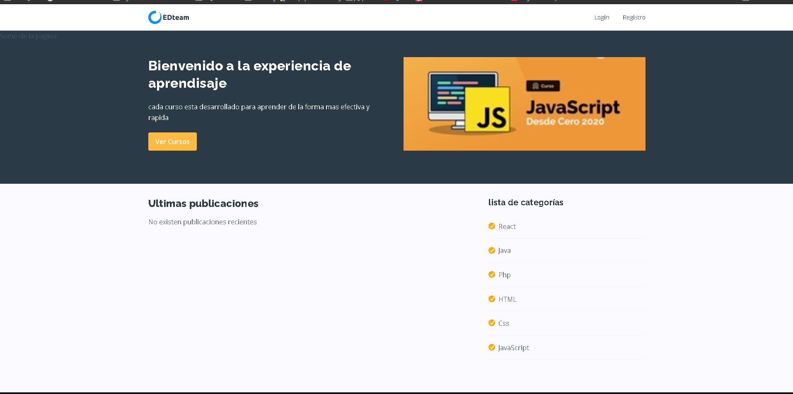
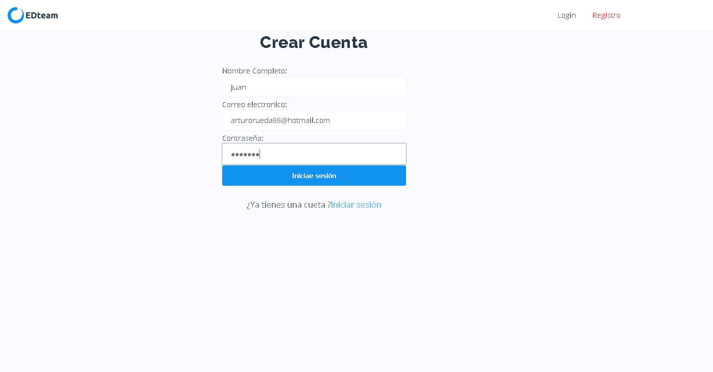
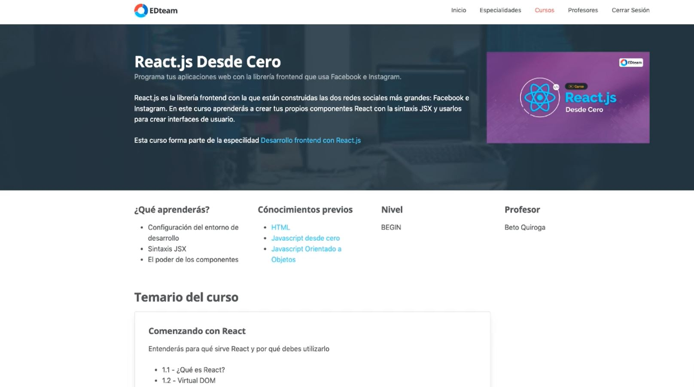
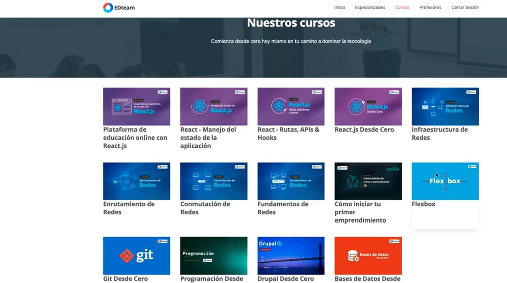
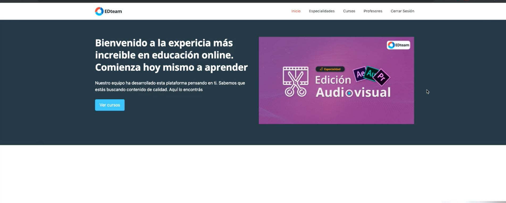

the objective is develop anonline education platform. This platform must provide users with the ability to register
(login) and start studying with the different courses that will be provided. Each course is made up of several classes and
each class can be made up of different videos.

## application characteristics

- authentication
  - Registration of new users
  - Login
- Home
  - Welcome banner
  - Curses grid
  - Community post
- Specialties
  - Pages of all specialities
  - Page of each speciality and its courses list
- Curses
  - Pages of all courses
  - Page of each course and its complete information
- Classes
  - Information about the course
- Teachers
  Teachers grid
- Transverse components
  - Header (Logo y main menu)
  - Footer

## Technical aspects

- Design

  it will be use style guide Edteam to visual components application

- Develop

  **Tools**:

  - it implements react to develop the app with this libraries:
    - Redux to manage the global state
      - React-redux
      - Redux-thunk
      - Redux dev tools
    - Axios to manage the API requests
    - React-router to manage routes
  - GIT like a version control system (the code will be in GitHub).
    - Rranches (minimum):
      - Master: code approved to production
      - Dev: code in developer environment

  **API:**

  the local environment it will be use JSON-server to simulate API request to backend server
  
  ## screen shot

## Login

## specialties page

## course grid

## Header

## Available Scripts

In the project directory, you can run:

### `npm start`

Runs the app in the development mode.\
Open [http://localhost:3000](http://localhost:3000) to view it in the browser.

The page will reload if you make edits.\
You will also see any lint errors in the console.

### `start JSON-server`

json-server --watch db.json --port 3005
